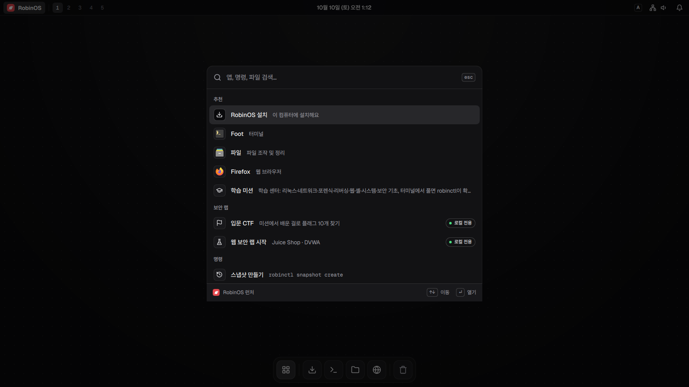
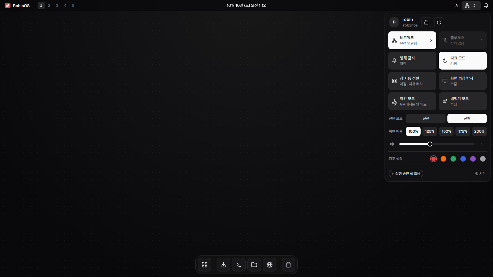
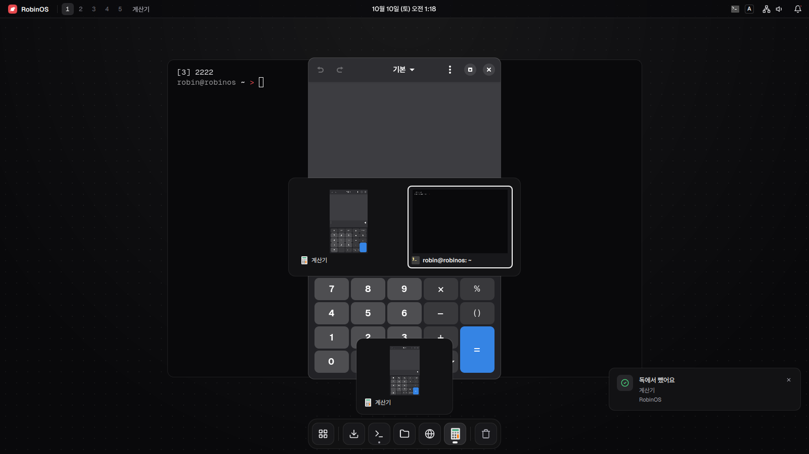
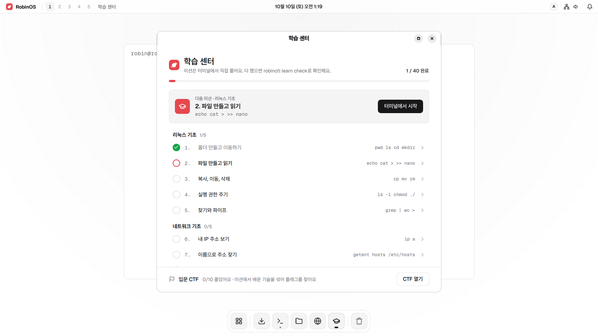

# RobinOS


RobinOS는 직접 만든 데스크톱과 도구로 이루어진, 매일 쓰는 나만의 OS예요. Arch Linux 위에 RobinOS 전용 셸, 설치기, 업데이트 저장소, 스냅샷 복구를 얹어서, 켜는 순간부터 하나의 OS처럼 느껴지게 만들어요.

윈도우에서 와도 바로 쓸 수 있고, 배우고 싶을 때는 학습 센터에서 리눅스와 보안을 미션으로 배울 수 있어요. 방향과 설계는 [docs/design.md](docs/design.md), 왜 만드는지는 [docs/vision.md](docs/vision.md)에 있어요.

**내려받기**: 최신 프리뷰는 [v0.2.0](https://github.com/Yoon-robin/RobinOS/releases/tag/v0.2.0)이에요(2026-10-10). 아직 VM에서만 검증한 프리뷰라 중요한 자료는 꼭 백업하세요. USB에 담기 전에 체크섬과 서명을 확인하는 방법은 [docs/install.md](docs/install.md)의 "내려받은 ISO 확인하기"에 있어요. 대부분의 PC는 USB로 켜기 전에 펌웨어 설정에서 **보안 부팅(Secure Boot)을 꺼야 해요**(같은 문서의 "보안 부팅 끄기").

## 화면

부팅 테스트(VM, 1600×900)가 찍은 화면이에요. 다크·라이트 모드를 고를 수 있어요.

| 런처 (`Win+Space`) | 빠른 설정 (`Win+S`) |
|---|---|
|  |  |
| **창 전환 (`Alt+Tab`)** | **학습 센터 (라이트 모드)** |
|  |  |

## 누구를 위한 OS인가요

이런 사람에게 맞아요:

- 남과 다른, 깔끔하게 다듬어진 데스크톱을 매일 쓰고 싶은 사람
- 윈도우에서 리눅스로 넘어오고 싶은데 어디서 시작할지 막막한 사람
- 리눅스, 네트워크, 웹 보안, 리버싱, 포렌식을 배우는 학생과 CTF 입문자
- 첫 부팅부터 글꼴, 한글 입력, 로캘, 문서가 자연스럽게 갖춰져 있길 바라는 한국어 사용자

이런 용도로 만들지 않았어요:

- 허가 없이 실제 시스템을 공격하는 일
- 활동 은폐, 지속성 확보, 탐지 회피, 자격 증명 탈취
- 합법적인 랩 환경 없이 공격 자동화 도구를 넣어 배포하는 일

## 핵심 아이디어

- 직접 만든 데스크톱: Hyprland 위에 RobinOS 전용 Quickshell 셸(바, 독, 런처, 빠른 설정, 알림 센터, 창 전환과 작업 보기, 환영 마법사, 학습 센터, 설치기)을 shadcn/ui zinc 스타일 하나로 그려요 ([docs/desktop.md](docs/desktop.md))
- 자체 시스템 계층: `robinctl`(진단, 업데이트, 스냅샷, 보안 점검, 학습, 랩), 직접 만든 설치기, 서명한 RobinOS 업데이트 저장소(v0.2.0 다음 버전부터)
- 매일 쓰는 데 필요한 것: Firefox, LibreOffice(한국어), 동영상·음악 재생, 앱 스토어(Flathub)와 Steam, 프린터, NVIDIA 그래픽 카드 드라이버(GTX 16, RTX 20 이후)
- 망가뜨려도 괜찮게: pacman 작업 전후 자동 Btrfs 스냅샷과 부팅 메뉴에서 되돌리기 ([docs/recovery.md](docs/recovery.md))
- 한글 입력, 한글 글꼴, 한국어 로캘과 문서가 기본
- 익숙한 입구: 자유 배치 창과 독, `Alt+Tab`, `Alt+F4`, `Win+E`, `Win+D`, `Win+V`(클립보드 기록), `Win+Shift+S`(캡처 도구)처럼 윈도우에서 쓰던 단축키가 그대로 동작해요. 런처에서 "제어판", "작업 관리자" 같은 윈도우 이름으로도 찾아져요. 전체 단축키와 셸 기능은 [docs/desktop.md](docs/desktop.md)에 있어요
- 배울 수 있는 OS: 학습 센터에 리눅스·네트워크·포렌식·리버싱·웹·셸·시스템·보안 기초·텍스트 다루기 미션 45개와 입문 CTF. 미션은 실제 터미널에서 풀어요. 보안 도구는 전부 쏟아 넣지 않고 학습 순서에 맞춘 프로필로 골라 깔고, 실습 랩은 컨테이너로 격리해요

## 주요 명령

`robinctl`로 할 수 있는 일이에요.

```bash
bin/robinctl version
bin/robinctl doctor
bin/robinctl audit
bin/robinctl app remove org.gnome.Calculator --dry-run
bin/robinctl profile list
bin/robinctl profile network --dry-run
bin/robinctl profile security --dry-run
bin/robinctl packages core
bin/robinctl packages web
bin/robinctl packages optional
bin/robinctl snapshot setup --dry-run
bin/robinctl snapshot list
bin/robinctl repo
bin/robinctl repo setup --dry-run
bin/robinctl learn
bin/robinctl learn show 1
bin/robinctl learn check 1
bin/robinctl ctf
bin/robinctl lab list
bin/robinctl lab info web
bin/robinctl lab info net
bin/robinctl lab status web
```

`robinctl doctor`는 데스크톱(Hyprland, Quickshell, RobinOS 셸)과 브랜딩 요소(SDDM 테마, 설치된 시스템의 GRUB 테마)도 확인해요. NVIDIA 그래픽 카드가 있으면 드라이버가 떠 있는지, 설치본에서는 인쇄 서비스가 켜져 있는지도 알려 줘요.

`robinctl audit`은 윈도우 보안 화면처럼 내 컴퓨터의 보안 상태를 보여 줘요. 다른 컴퓨터가 접속할 수 있는 서비스, SSH 서버, 홈 폴더와 SSH 열쇠 권한, 스냅샷, 방화벽, 디스크 암호화를 보고, 줄마다 왜 중요한지와 바꾸는 방법(관련 미션 번호)을 알려 줘요. 아무것도 바꾸지 않고 관리자 권한도 필요 없어요. 런처에서 "보안 점검"이나 "Windows 보안"으로도 열려요.

## 학습 미션

`robinctl learn`은 터미널에서 직접 풀어 보는 미션 45개예요. 리눅스, 네트워크, 포렌식, 리버싱, 웹, 셸, 시스템, 보안 기초, 텍스트 다루기가 5개씩 차례로 이어져요. 미션마다 윈도우에서는 어떻게 하는지와 비교해 설명하고, `robinctl learn check`가 결과를 확인해 진행도를 저장해요. 런처에서 "학습 미션"을 고르면 학습 센터 창에서 진행도와 다음 미션을 보고, 고른 미션을 터미널에서 열 수 있어요.

| # | 미션 | 배우는 명령 |
|---|---|---|
| 1 | 폴더 만들고 이동하기 | `pwd`, `ls`, `cd`, `mkdir` |
| 2 | 파일 만들고 읽기 | `echo`, `cat`, `>`, `>>`, `nano` |
| 3 | 복사, 이동, 삭제 | `cp`, `mv`, `rm` |
| 4 | 실행 권한 주기 | `ls -l`, `chmod`, `./` |
| 5 | 찾기와 파이프 | `grep`, `\|`, `wc`, `>` |
| 6 | 내 IP 주소 보기 | `ip a` |
| 7 | 이름으로 주소 찾기 | `getent hosts`, `/etc/hosts` |
| 8 | 네트워크 도구 설치하기 | `robinctl profile network` (인터넷 필요) |
| 9 | 포트 열고 확인하기 | `nc -l`, `ss -tln` |
| 10 | 내 컴퓨터 스캔하기 | `nmap 127.0.0.1` (내 컴퓨터만) |
| 11 | 파일의 진짜 종류 알아내기 | `file`, `xxd` |
| 12 | 해시로 같은 파일 찾기 | `sha256sum` |
| 13 | 사진 속 정보 읽기 | `exiftool` |
| 14 | 파일 속에 숨은 파일 찾기 | `binwalk`, `strings`, `bsdtar` |
| 15 | 로그에서 수상한 접속 찾기 | `grep`, `sort`, `uniq -c` |
| 16 | 실행 파일 살펴보기 | `file`, `readelf` |
| 17 | 프로그램 속 글자 찾기 | `strings` |
| 18 | 라이브러리 호출 엿보기 | `ltrace` |
| 19 | 시스템 호출 엿보기 | `strace` |
| 20 | 기계어 읽어 보기 | `objdump` |
| 21 | 웹 서버 켜고 접속하기 | `python3`, `curl` |
| 22 | 응답 헤더 읽기 | `curl -I` |
| 23 | robots.txt 읽기 | `curl`, `robots.txt` |
| 24 | 쿠키 주고받기 | `curl -c`, `curl -b` |
| 25 | 상태 코드와 리다이렉트 | `curl -i`, `curl -L` |
| 26 | 환경 변수 보기 | `echo $HOME`, `env` |
| 27 | 명령은 어디에 있을까 (PATH) | `echo $PATH`, `which` |
| 28 | 명령에 별명 붙이기 | `alias`, `~/.bashrc` |
| 29 | 스크립트에 값 넘기기 | `$1`, 큰따옴표와 작은따옴표 |
| 30 | 종료 코드와 && \|\| | `echo $?`, `&&`, `\|\|` |
| 31 | 실행 중인 프로그램 보기 | `ps`, `pgrep`, `&`, `$!` |
| 32 | 프로그램 끝내기 | `kill` |
| 33 | 디스크 공간 보기 | `df -h`, `du -sh` |
| 34 | 서비스 상태 보기 | `systemctl status`, `systemctl is-active` |
| 35 | 시스템 기록 읽기 | `journalctl`, `uname -r` |
| 36 | 사용자와 그룹 보기 | `whoami`, `id`, `groups` |
| 37 | 나만 읽는 파일 만들기 | `chmod 600`, `ls -l` |
| 38 | SSH 열쇠 만들기 | `ssh-keygen -t ed25519` |
| 39 | 내려받은 파일 검사하기 | `sha256sum -c` |
| 40 | 파일 암호화하기 | `gpg -c`, `gpg -d` |
| 41 | 줄 세고 거르기 | `grep -c`, `wc -l` |
| 42 | 가장 많이 온 주소 찾기 | `cut`, `sort`, `uniq -c` |
| 43 | 칸 골라내기 | `awk`, `sort -u` |
| 44 | 비밀번호 가리기 | `sed` |
| 45 | 두 파일 비교하기 | `diff`, `comm` |

리버싱 미션의 연습 프로그램은 직접 만든 작은 C 프로그램이에요. 소스는 [practice/reversing](practice/reversing)에 있고, 요령을 쓰면 코드를 보여 주는 것 말고는 아무 일도 하지 않아요. 웹 기초 미션의 연습 서버([practice/web/server.py](practice/web/server.py))는 파이썬 표준 라이브러리만 쓰고 `127.0.0.1:8000`에서만 열려요.

실습 파일은 모두 `~/practice`에 만들고, 진행도는 `~/.local/state/robinos/learn`에 저장해요. 처음부터 다시 하려면 `robinctl learn reset`을 실행하세요.

## 입문 CTF

미션을 끝냈다면 `robinctl ctf`로 입문 CTF 문제 10개를 풀어요. 미션처럼 할 일을 하나하나 알려 주지 않고, 미션에서 배운 기술(숨은 파일, 인코딩, 로그 분석, 반복 대입, 쿠키, 해시 검사, 권한, 사전 공격, 포트 찾기, 파일 속 파일)을 스스로 골라 써서 `ROBIN{...}` 모양의 플래그를 찾아요. 문제 파일은 `~/practice/ctf`에 생기고, 5번은 웹 연습 서버를 써요. 모두 내 컴퓨터 안에서만 풀어요. 푸는 요령과 다음에 연습할 곳은 [docs/ctf.md](docs/ctf.md)에 있어요.

```bash
robinctl ctf                               # 문제 목록과 푼 것
robinctl ctf show 1                        # 문제와 힌트
robinctl ctf submit 1 'ROBIN{...}'         # 플래그 확인
```

## 설치

라이브 USB로 부팅해서 독 맨 앞의 **RobinOS 설치**를 눌러요. 윈도우 옆에 설치하거나 디스크 전체를 쓸 수 있고, 디스크 나누기, 한국어 설정, 업데이트 전 자동 스냅샷까지 설치기가 알아서 해요. 이미 Arch를 쓰고 있다면 `sudo scripts/post-install.sh`로 RobinOS를 입힐 수 있어요. 자세한 방법은 [docs/install.md](docs/install.md)에 있어요.

## 빌드와 검증

빌드와 테스트는 개발 PC에서 해요. GitHub Actions는 수동 실행으로만 남겨 뒀어요([docs/ci.md](docs/ci.md)). 윈도우 PC에서는 WSL 2의 Arch Linux를 써요([docs/build-environment.md](docs/build-environment.md)).

```powershell
powershell -ExecutionPolicy Bypass -File scripts/validate-project.ps1
powershell -ExecutionPolicy Bypass -File scripts/wsl-build.ps1 check
powershell -ExecutionPolicy Bypass -File scripts/wsl-build.ps1 build
powershell -ExecutionPolicy Bypass -File scripts/wsl-build.ps1 boot-test
powershell -ExecutionPolicy Bypass -File scripts/wsl-build.ps1 install-test
```

무엇을 바꿨을 때 어떤 검사를 돌릴지는 [docs/testing.md](docs/testing.md)에 있어요.

## 문서와 작업 관리

- [docs/README.md](docs/README.md): 문서 지도. 어떤 문서가 무엇의 원본인지 정리돼 있어요.
- [docs/design.md](docs/design.md): 제품 설계와 v0.1 범위의 진행 상황
- [docs/tasks.md](docs/tasks.md): 지금 할 일과 진행 중인 작업
